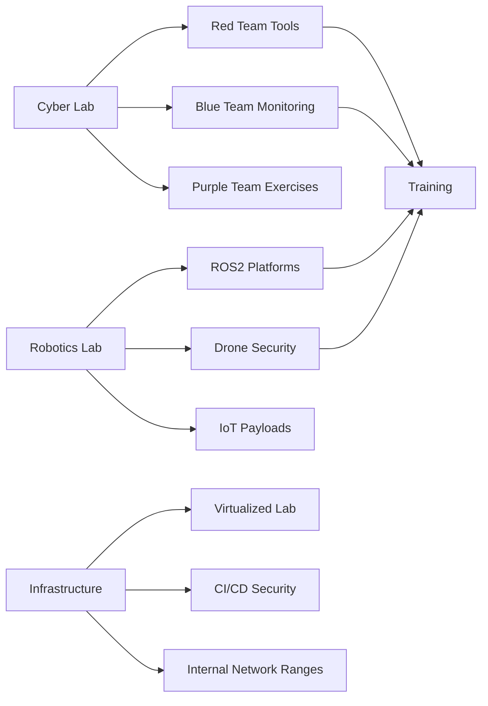
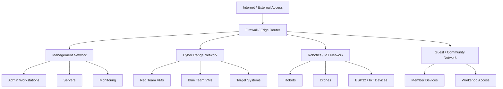
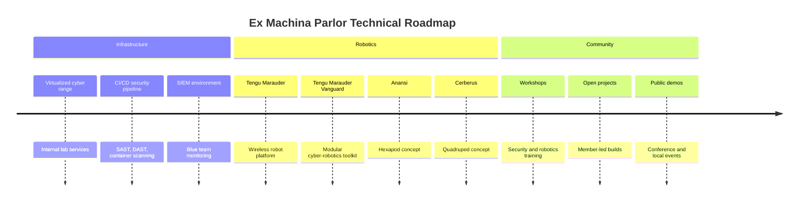

<div align="center">

# Ex Machina Parlor

### Cybersecurity Hackerspace · Robotics Lab · Autonomous Systems Playground

**Building offensive, defensive, and experimental security projects for drones, robots, IoT, wireless systems, resilient infrastructure, and cyber-physical systems.**

<br>

[](https://exmachinaparlor.org/)
[](https://github.com/ExMachinaParlor)
[](#)
[](#)
[](#)

<br>

[](https://exmachinaparlor.org/)
[](https://exmachinaparlor.org/projects.html)
[](https://exmachinaparlor.org/events.html)
[](https://github.com/ExMachinaParlor)
[](https://www.instagram.com/exmachinaparlor)
[](https://bsky.app/profile/exmachinaparlor.bsky.social)
[](https://www.patreon.com/ExMachinaParlor)
[](https://venmo.com/ExMachinaParlorLLC)

```bash
$ whoami
ex-machina-parlor

$ mission
Build cyber-physical systems.
Train hackers.
Prototype resilient infrastructure.
Experiment responsibly.

$ status
Lab online. Projects loading...
```

</div>
---

## Recent and Featured Projects

<table>
<tr>
<td width="33%" align="center">

### Tengu Marauder Vanguard


A modular cybersecurity robotics platform and toolkit for building, deploying, and demonstrating cyber-physical security capabilities.

**Highlights**

- Recent Black Hat USA 2025 Arsenal and DEFCON 33 demo focus
- Modular cyber-robotics payload concept
- Built around the Tengu Marauder project family
- Designed for workshops, demos, and field experimentation

[Black Hat / DEFCON Announcement](https://www.linkedin.com/posts/exmachinaparlor_black-hat-activity-7356716757954269184-1j9o)  
[GitHub Organization](https://github.com/ExMachinaParlor)

</td>
<td width="33%" align="center">

### Tengu Marauder


A mobile platform based on the ESP32 microcontroller that combines WiFi security capabilities with robotic control and live video streaming.

**Highlights**

- WiFi scanning
- Packet analysis
- ESP32-CAM video streaming
- ROS2 movement integration
- DEFCON 32 Demo Labs project

[Tengu Marauder Repo](https://github.com/ExMachinaParlor/Tengu-Marauder)  
[Tengu Marauder at DEFCON 32](https://infocondb.org/con/def-con/def-con-32/tengu-marauder)

</td>
<td width="33%" align="center">

### Strix Interceptor


An open-source UAV security research platform designed for drone interception, autonomous flight, stability control, and RF-aware experimentation.

**Highlights**

- UAV security research
- Pixhawk flight controller
- Raspberry Pi integration
- HackRF One payload concepts
- DEFCON 31 Demo Labs project

[Strix Interceptor at DEFCON 31](https://infocondb.org/con/def-con/def-con-31/strix-interceptor)

</td>
</tr>
</table>

---

## Project Quick Links

<div align="center">

[](https://github.com/ExMachinaParlor/Tengu-Marauder)
[](https://github.com/ExMachinaParlor)
[](https://exmachinaparlor.org/projects.html)
[](https://infocondb.org/con/def-con/def-con-32/tengu-marauder)
[](https://infocondb.org/con/def-con/def-con-31/strix-interceptor)

</div>


## What We Are

**Ex Machina Parlor** is a cyber-centric hackerspace and project lab focused on practical security research, hands-on technical education, hardware hacking, robotics, and experimental infrastructure.

We work across:

<table>
<tr>
<td width="50%">

### Cybersecurity

- Red, blue, and purple team labs
- Wireless security research
- IoT and embedded systems testing
- Application security pipelines
- SIEM, detection, and defensive engineering
- Secure infrastructure experimentation

</td>
<td width="50%">

### Robotics & Autonomous Systems

- ROS2-based robotics
- Drone and UAV security
- Robot control systems
- Sensor integration
- Autonomous system threat modeling
- Cyber-physical experimentation

</td>
</tr>
</table>

---

<div align="center">

## Mission

### Make advanced cybersecurity, robotics, and hardware hacking accessible through hands-on community projects.

We believe the best way to learn is to build real systems, break them safely, understand how they fail, and improve them.

</div>

---

## Lab Status

| Area | Status | Notes |
|---|---:|---|
| Cyber Range | Active | Red/Blue/Purple team lab development |
| Robotics Lab | Building | ROS2 platforms and mobile payloads |
| Wireless Lab | Active | ESP32, SDR, WiFi, Bluetooth experimentation |
| Fabrication | Active | 3D printing, scanning, soldering, prototyping |
| Public Workshops | Planning | Member classes and community sessions |
| Documentation | Ongoing | Project writeups, build guides, and lab notes |

---

## Current Lab Work



---

## Lab Architecture



---

## Research Areas

<table>
<tr>
<td width="50%">

### Wireless & RF Security

- WiFi security testing
- Bluetooth experimentation
- SDR and RF analysis
- Drone communication research
- Mesh and off-grid communications

</td>
<td width="50%">

### Cyber-Physical Systems

- Robotics security
- UAV threat modeling
- Sensor spoofing research
- Embedded systems testing
- Autonomous system resilience

</td>
</tr>

<tr>
<td width="50%">

### Infrastructure Security

- Virtualized cyber ranges
- Identity and access labs
- Firewall and routing experiments
- SIEM and logging pipelines
- Network segmentation testing

</td>
<td width="50%">

### Application Security

- CI/CD security testing
- Container scanning
- SAST and DAST workflows
- Secure coding labs
- DevSecOps tooling

</td>
</tr>
</table>

---

## Tools, Platforms, and Technologies

<div align="center">


</div>

---

## Repository Categories

<table>
<tr>
<td width="33%">

### Offensive Security

- Wireless testing
- Embedded payloads
- Lab attack simulations
- Red team tooling
- Adversary emulation

</td>
<td width="33%">

### Defensive Security

- Detection engineering
- Blue team labs
- SIEM pipelines
- Secure infrastructure
- Incident response practice

</td>
<td width="33%">

### Cyber-Physical Systems

- Robotics
- Drones
- IoT systems
- RF experimentation
- Autonomous platforms

</td>
</tr>
</table>

---

## Past and Current Projects

| Project | Description | Status |
|---|---|---|
| **Tengu Marauder Vanguard** | Advanced modular framework and toolkit for modular cybersecurity robot operations | Most Recent / Active |
| **Tengu Marauder** | ESP32-based wireless security robotics platform | Active |
| **Strix Interceptor** | UAV security and drone interception research platform | Research / Prototype |
| **Anansi** | Hexapod cybersecurity robot concept | Concept |
| **Cerberus** | Quadruped cybersecurity robot concept | Concept |
| **DEFCON Demo Lab Projects** | Conference-built demos, cyber-robotics prototypes, and security experiments | Past / Ongoing |
| **Cyber Lab Infrastructure** | Virtualized red/blue/purple team environment | Active |
| **CI/CD Security Pipeline** | SAST, DAST, container scanning, and secure development tooling | Active |
| **Fabrication Lab** | 3D printing, 3D scanning, soldering, and prototyping | Active |

---

## Current Roadmap



---

## Community & Education

We host and support hands-on learning around:

- Cybersecurity fundamentals
- Wireless security
- Robotics and ROS2
- Linux administration
- Soldering and electronics
- 3D printing and prototyping
- Capture-the-flag style labs
- Cyber-physical security research
- DevSecOps and application security workflows

Our goal is to give people a place to move from theory to practice.

---

## Get Involved

We welcome builders, hackers, engineers, artists, students, veterans, and anyone interested in learning by doing.

You can contribute by:

- Opening issues
- Submitting pull requests
- Improving documentation
- Testing builds
- Joining project discussions
- Proposing new cyber-physical experiments
- Helping with workshops
- Donating hardware or lab equipment

---

## Support the Lab

Ex Machina Parlor is community-driven and project-focused. Support helps maintain infrastructure, tools, hardware, workshop materials, and public learning resources.

Ways to support:

- Contribute code or documentation
- Donate hardware or tools
- Sponsor a workshop
- Help maintain lab infrastructure
- Mentor new members
- Share project feedback

[Support on Patreon](https://www.patreon.com/ExMachinaParlor) · [Support on Venmo](https://venmo.com/ExMachinaParlorLLC)

---

## Responsible Use

Projects in this organization are intended for:

- Authorized security research
- Education and training
- Defensive testing
- Lab environments
- Responsible disclosure workflows

Do not use these tools or techniques against systems, networks, devices, or people without explicit authorization.

---

## Contact

| Platform | Link |
|---|---|
| Website | [](https://exmachinaparlor.org/) |
| GitHub | [](https://github.com/ExMachinaParlor) |
| Projects | [](https://exmachinaparlor.org/projects.html) |
| Events | [](https://exmachinaparlor.org/events.html) |
| Instagram | [](https://www.instagram.com/exmachinaparlor) |
| Bluesky | [](https://bsky.app/profile/exmachinaparlor.bsky.social) |
| Patreon | [](https://www.patreon.com/ExMachinaParlor) |
| Venmo | [](https://venmo.com/ExMachinaParlorLLC) |
| Project Discussions | Use GitHub Issues / Discussions |

For project-specific questions, open an issue in the relevant repository.

---

<div align="center">

## Ex Machina Parlor

**Build. Break. Learn. Defend.**

[](https://github.com/ExMachinaParlor)

</div>


